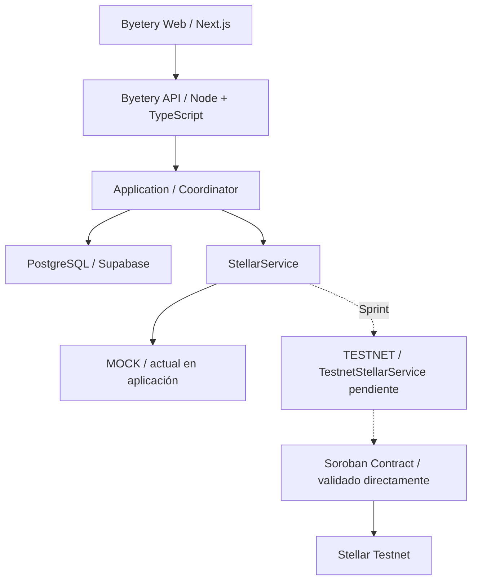

# Byetery — Arquitectura del MVP

Proyecto: Byetery · Ecosistema: Stellar

Red de validación: Stellar Testnet · Fecha: septiembre de 2026

## 1. Resumen del proyecto

Byetery es un sistema de trazabilidad para baterías que permite seguir su ciclo desde el registro hasta su devolución, recolección y reciclaje, incorporando una recompensa de prueba asociada al reciclaje confirmado.

**Problema:** información fragmentada → poca trazabilidad → dificultad para verificar el recorrido → pocos incentivos transparentes.

El MVP reúne registros, responsables y evidencia de cada etapa. No cuantifica impactos ambientales ni certifica por sí mismo el reciclaje físico.

## 2. Actores y responsabilidades

| Actor | Responsabilidad |
| --- | --- |
| Usuario | Consulta su batería, vincula una dirección Stellar y solicita la devolución. |
| Administrador | Registra baterías y administra las autorizaciones correspondientes. |
| Punto de recolección / Collector | Confirma la recepción con evidencia y autorización del servicio. |
| Reciclador / Recycler | Confirma el reciclaje y aporta la evidencia correspondiente. |
| Servicio Byetery | Valida solicitudes y coordina operaciones y recompensas autorizadas. |

## 3. Flujo funcional y estados

**Lifecycle on-chain:** REGISTERED → RETURNED → COLLECTED → RECYCLED.

**Reward on-chain:** NOT_ELIGIBLE → PENDING → SENT.

El estado físico y la recompensa se manejan por separado: confirmar reciclaje deja la recompensa en PENDING; pagar la lleva a SENT y la batería permanece RECYCLED. RETURNED representa una devolución solicitada, no una recepción física confirmada. El diagrama muestra el camino principal; existe cancelación autorizada antes de la recolección.

<!-- pagebreak -->

## 4. Arquitectura e integración

**Frontend.** Interfaz web con vistas por rol, QR, asociación de wallet, historial y estados. Consume la API; no decide las autorizaciones del contrato.

**Backend.** Lógica de negocio, autenticación, validaciones y coordinación de operaciones. Conserva evidencia y aplica idempotencia: repetir una solicitud con la misma clave no debe crear otra operación. La interacción Stellar pasa por StellarService.

**Supabase / PostgreSQL.** Mantiene identidad y datos operacionales y personales off-chain. La aplicación distingue sus operaciones pendientes de las observaciones confirmadas de blockchain.

**Stellar / Soroban.** Registra estados relevantes, autorización de actores, compromisos criptográficos y la recompensa de prueba. El contrato ya se validó directamente en Testnet; la conexión desde la aplicación se completará en el sprint.

**Situación actual:** MockStellarService simula operaciones; no ejecuta Soroban, no carga WASM y no envía transacciones. TestnetStellarService todavía no está implementado en esta rama. Las confirmaciones MOCK no se convierten en evidencia Testnet.

## 5. Qué va on-chain y qué queda off-chain

| On-chain — Soroban | Off-chain — aplicación / almacenamiento privado |
| --- | --- |
| Battery ID y estados del lifecycle | Metadata extendida de batería |
| Request ID | Datos personales y cuenta Supabase |
| Actores autorizados | Permisos y notas operacionales internas |
| Evidence commitments (compromisos hash) | Fotografías y evidencias completas, cuando se incorporen |
| Estado de reward y transferencia del reward | Información interna y seguimiento de operaciones |

El hash permite verificar integridad, pero blockchain no demuestra por sí sola que el reciclaje físico haya ocurrido. La confirmación física depende de actores autorizados y evidencia externa. El almacenamiento completo de fotografías es parte del diseño; la validación actual usa manifiestos de prueba.

<!-- pagebreak -->

## 6. QR: identificación, no autorización

**QR = identificación · QR ≠ autorización.** Permite localizar la batería por su ruta o identificador. No permite confirmar recepción, reciclaje ni rewards. Esas operaciones requieren autenticación y los permisos correspondientes. El checkpoint incluye QR; la cámara integrada no se presenta como validada aquí.

## 7. Wallet

La wallet permite asociar una dirección Stellar. Byetery no debe almacenar la clave privada del usuario. El MVP está pensado inicialmente alrededor de Freighter; multi-wallet queda fuera del alcance inmediato.

El checkpoint tiene verificación mediante firma externa, pero no acredita una integración gráfica end-to-end con Freighter. La validación directa Testnet utilizó identidades de prueba del CLI.

## 8. Trabajo previo y sprint Instaward

### Validado antes del sprint

Arquitectura definida; MVP web, backend, base de datos, autenticación, roles y QR implementados y probados en DEV/MOCK. Contrato Soroban probado localmente y validado directamente en Stellar Testnet, con recompensa real de prueba y rechazo de doble pago.

Estas capacidades son la base existente; no se presentan como trabajo financiado por Instaward. La arquitectura documenta también componentes futuros: no implica que toda la integración esté terminada.

### Trabajo del sprint

Mejoras frontend y backend; UX; integración aplicación → Stellar Testnet mediante TestnetStellarService; reconciliación de estados y transacciones; ejecución end-to-end del ciclo y reward desde la aplicación; pruebas, documentación y demo final verificable.

## 9. Alcance de la entrega

**Incluye:** MVP web, Stellar Testnet, Soroban, reward de prueba y flujo completo verificable desde la aplicación al finalizar el sprint.

**Fuera de alcance:** Mainnet, producción, tokenomics, venta pública de tokens, IoT, logística física, app móvil nativa y despliegue industrial.

### Fuentes del repositorio

[Arquitectura](../ARCHITECTURE.md), [validación frontend MVP](../verification/FRONTEND-MVP.md), [validación Testnet](../TESTNET-CONTRACT-VALIDATION.md), [Coordinator](../../backend/src/application/coordinator.ts) y [MockStellarService](../../backend/src/mock-stellar-service.ts). El informe Testnet del 26 de septiembre prevalece sobre referencias históricas que aún describen esa validación como pendiente.
