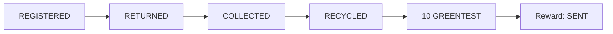

# Byetery — Validación Técnica en Stellar Testnet

Proyecto: Byetery · Ecosistema: Stellar

Red de validación: Stellar Testnet · Fecha: septiembre de 2026

## 1. Resultado

El contrato Soroban de Byetery fue desplegado y validado en Stellar Testnet el 26 de septiembre de 2026. Se ejecutó correctamente REGISTERED → RETURNED → COLLECTED → RECYCLED y, después, el pago dejó la recompensa en SENT: se transfirieron **10 GREENTEST** y se rechazó un segundo pago.

La validación fue directa contra el contrato. La aplicación continúa en DEV/MOCK; la integración completa desde la interfaz es trabajo del sprint.

## 2. Configuración pública

| Parámetro | Valor |
| --- | --- |
| Contract ID Byetery | `CDMGW6M3A56EHHEQPP5A3NGTWWETFP7LOMB3CU5S67374VT3BPVCNWON` |
| Stellar Asset Contract (SAC) | `CB2RBZCH2DKLB2KFTKKEIDJBK53WKT2FQBQRTAN2JKJVEBAMCDEY6D7G` |
| Asset | Display: GREEN-TEST · Classic code: GREENTEST |
| Reward | 10 GREENTEST, sin valor monetario |
| Network | Stellar Testnet |

[Abrir contrato en Stellar Lab](https://lab.stellar.org/r/testnet/contract/CDMGW6M3A56EHHEQPP5A3NGTWWETFP7LOMB3CU5S67374VT3BPVCNWON).

## 3. Flujo probado

RECYCLED es el estado físico final; SENT corresponde a la recompensa. El pago realiza la transferencia y el cambio a SENT de forma atómica: ambos tienen éxito juntos.

## 4. Balances verificados

| Cuenta | Antes | Después |
| --- | --- | --- |
| Contrato Byetery | 100 GREENTEST | 90 GREENTEST |
| Recipient (destinatario) | 0 GREENTEST | 10 GREENTEST |

Un segundo intento de reward fue rechazado; los balances permanecieron en **90 y 10 GREENTEST**, respectivamente.

<!-- pagebreak -->

## 5. Evidencia de transacciones

Las seis operaciones siguientes constan como confirmadas en el informe fuente, que registra `getTransaction=SUCCESS`. Cada hash enlaza a Stellar Expert Testnet.

| Operación | Tx hash / Stellar Expert Testnet |
| --- | --- |
| deploy-byetery | [`e97f13bd21513428849a9743a83ffb7b141082c6e286ced19b730243a4585933`](https://stellar.expert/explorer/testnet/tx/e97f13bd21513428849a9743a83ffb7b141082c6e286ced19b730243a4585933) |
| register-battery | [`34b20bf6ad291bc49cacac60a5638b51cec9e54eb76b2cfe963a6cab3d94fef6`](https://stellar.expert/explorer/testnet/tx/34b20bf6ad291bc49cacac60a5638b51cec9e54eb76b2cfe963a6cab3d94fef6) |
| open-return | [`99423a60f9c0313e5eba69f6c54324519304813035b0bfc46d32ac14ce3643d3`](https://stellar.expert/explorer/testnet/tx/99423a60f9c0313e5eba69f6c54324519304813035b0bfc46d32ac14ce3643d3) |
| confirm-collection | [`a57dafee61605c54aa136dd9a5359616ea0d274dc7355ddac292ab7ae94ad64d`](https://stellar.expert/explorer/testnet/tx/a57dafee61605c54aa136dd9a5359616ea0d274dc7355ddac292ab7ae94ad64d) |
| confirm-recycling | [`125a122cbf4663921308e92a97e2b5f721a4e66fa616ba39e4c74e716cd36153`](https://stellar.expert/explorer/testnet/tx/125a122cbf4663921308e92a97e2b5f721a4e66fa616ba39e4c74e716cd36153) |
| pay-reward | [`9053c28bc5d711e6cce7e186b0213b14a3cdf03733fc8652e189eb7ca1aee241`](https://stellar.expert/explorer/testnet/tx/9053c28bc5d711e6cce7e186b0213b14a3cdf03733fc8652e189eb7ca1aee241) |

Son comprobantes de la ejecución histórica del 26 de septiembre de 2026. Testnet puede reiniciarse; estos enlaces no garantizan la conservación indefinida del despliegue. Los resultados públicos se preservan también en el repositorio.

## 6. Autorización por operación

| Operación | Autorización requerida |
| --- | --- |
| register_battery | ADMIN |
| open_return | SERVICE |
| confirm_collection | COLLECTOR + SERVICE |
| confirm_recycling | RECYCLER |
| pay_reward | SERVICE |

Las operaciones sensibles exigen autorización según el rol. ADMIN y SERVICE son direcciones fijadas en la configuración; COLLECTOR y RECYCLER deben estar habilitados. Para la recolección se requieren ambas autorizaciones sobre los mismos argumentos. SERVICE representa las acciones de usuarios autenticados off-chain; esta prueba directa no simula un login Supabase.

<!-- pagebreak -->

## 7. Pruebas negativas

| Caso probado | Resultado |
| --- | --- |
| Duplicate battery — registro duplicado | Rechazado |
| Reward before recycling — pago anticipado | Rechazado |
| Unauthorized collector — recolector sin rol | Rechazado |
| Recycling before collection — salto de etapa | Rechazado |
| Missing service auth — falta SERVICE | Rechazado |
| Missing collector auth — falta COLLECTOR | Rechazado |
| Duplicate reward — segundo pago | Rechazado |
| Invalid backward transition — recolección tras RECYCLED | Rechazado |

Estos rechazos ocurrieron durante simulación o validación de autorización, sin envío. Las operaciones rechazadas durante simulación no generan necesariamente una transacción on-chain; por tanto, no se asignan hashes inventados a esos casos.

## 8. Evidence commitments

**SHA-256 + XDR + BYETERY_EVIDENCE_V1.** SHA-256 produce una huella de los datos; XDR define su codificación reproducible; BYETERY_EVIDENCE_V1 identifica el formato y dominio de la evidencia. El cálculo incluye red, contrato y evidencia vinculada a batería y solicitud.

Permite comparar la integridad de la evidencia off-chain con el commitment almacenado en Soroban. En esta ejecución coincidieron los compromisos de recolección y reciclaje. No prueba que el contenido declarado describa un reciclaje físico verdadero.

## 9. Testing del checkpoint validado

Resultados documentados en el informe del 26 de septiembre, correspondientes a esta rama. No son nuevas ejecuciones realizadas para preparar este resumen.

| Suite / comprobación | Resultado registrado |
| --- | --- |
| Rust contract tests | 20/20 nativos |
| Prueba WASM / build release | 1/1; build PASS y SHA-256 idéntico al congelado |
| Backend Foundation / TypeScript | 50/50; tipos PASS |
| HTTP Supabase DEV + API local MOCK | **43/43 PASS**, sin fallos ni omitidos |
| Frontend | 33/33; tipos, lint y build PASS |
| SQL PGlite | 82/82; rollback, 0 fixtures restantes |
| Python | 4/4 |
| Demo MOCK | PASS; ciclo y 10 GREEN-TEST simulados |

La demo MOCK no ejecuta Soroban. La suite HTTP valida API y Supabase DEV; la evidencia real Testnet está en las transacciones de la sección 5. No se mezclan recuentos de wallet/QR de otras ramas.

<!-- pagebreak -->

## 10. Seguridad y revisión documental

**0 secrets detected** en la auditoría local actual del 26 de septiembre de 2026: 215 archivos y 193 blobs del historial examinados, 0 archivos en staging y 0 hallazgos. Se utilizó el auditor existente del repositorio, que incluye logs locales de la fase. Es una detección por patrones, no una garantía absoluta de ausencia de secretos.

Los identificadores y hashes publicados son públicos. Este material no incluye claves privadas, frases semilla, credenciales de base de datos, secretos de Supabase ni tokens de acceso.

## 11. Qué demuestra y qué no demuestra

### Demuestra

- Contrato desplegable y máquina de estados funcional.
- Roles y autorizaciones, incluida la doble autorización de recolección.
- Evidence commitments contrastados con el almacenamiento on-chain.
- Transferencia de recompensa GREENTEST y prevención del doble reward.
- Ejecución real en Stellar Testnet.

### No demuestra todavía

- Integración completa desde frontend ni validación end-to-end con Freighter.
- Preparación para producción o Mainnet.
- Reciclaje físico real ni certificación ambiental.
- Valor monetario de la recompensa.

### Fuentes y trazabilidad

Fuente principal: [TESTNET-CONTRACT-VALIDATION.md](../TESTNET-CONTRACT-VALIDATION.md), apartados de identificadores, flujo, transacciones, autorizaciones, pruebas negativas y suites. Contraste: [resultados públicos del 26 de septiembre](../testnet/validation-2026-09-26.json), [implementación del commitment](../../backend/src/evidence.ts) y [validación frontend del checkpoint](../verification/FRONTEND-MVP.md).

Este resumen conserva los resultados existentes. No se ejecutó un nuevo deployment, flujo Testnet ni modificación del contrato para elaborarlo.

## 12. Relación con el Instaward

Esta validación reduce el riesgo técnico del proyecto. El sprint propuesto se enfoca en mejorar el MVP y completar la integración end-to-end entre la aplicación Byetery y Stellar Testnet, de modo que el flujo validado directamente contra el contrato pueda ejecutarse y demostrarse desde la aplicación.
